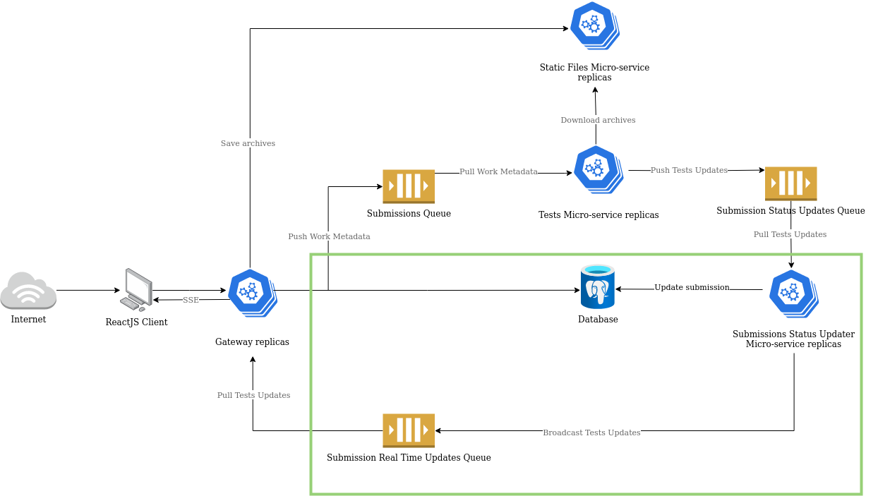

# Submissions Status Updater micro-service

Welcome to the Submissions Status Updater micro-service. This service is responsible for listening for messages in the `submission-status-updates` queue and updating the status of the submissions in the database and publishing the updated submissions to the `real-time-updates` queue.

Below is a diagram of the overall architecture of the system with the Submissions Status Updater micro-service highlighted in green.

## Documentation

Please, refer to the following documents for more information about the Submissions Status Updater micro-service:

| Document                               | Description                                                                                      |
| -------------------------------------- | ------------------------------------------------------------------------------------------------ |
| [Contributing](./docs/contributing.md) | Contributing guidelines.                                                                         |
| [Environment](./docs/environment.md)   | A description of the environment variables used by the Submissions Status Updater micro-service. |
